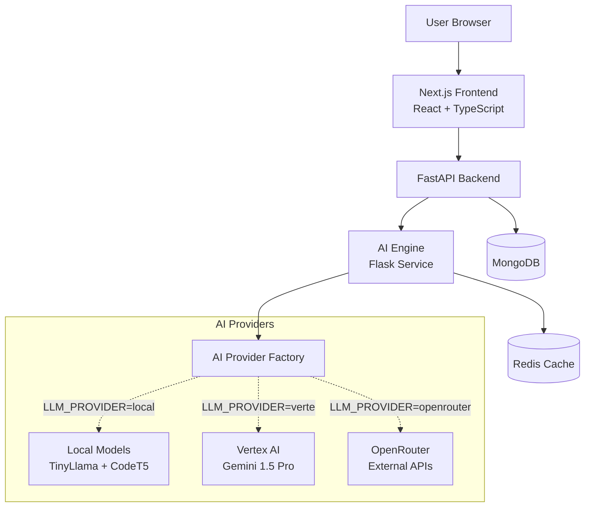
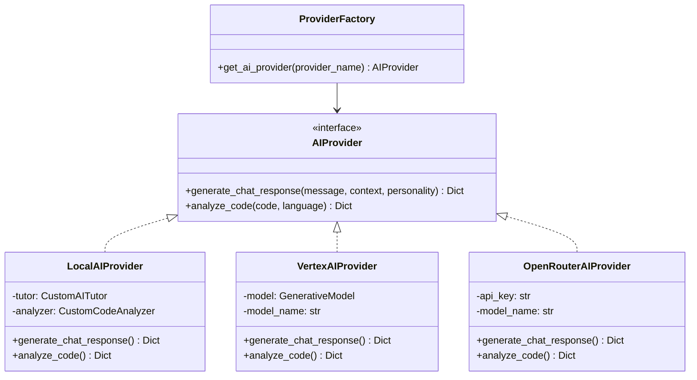
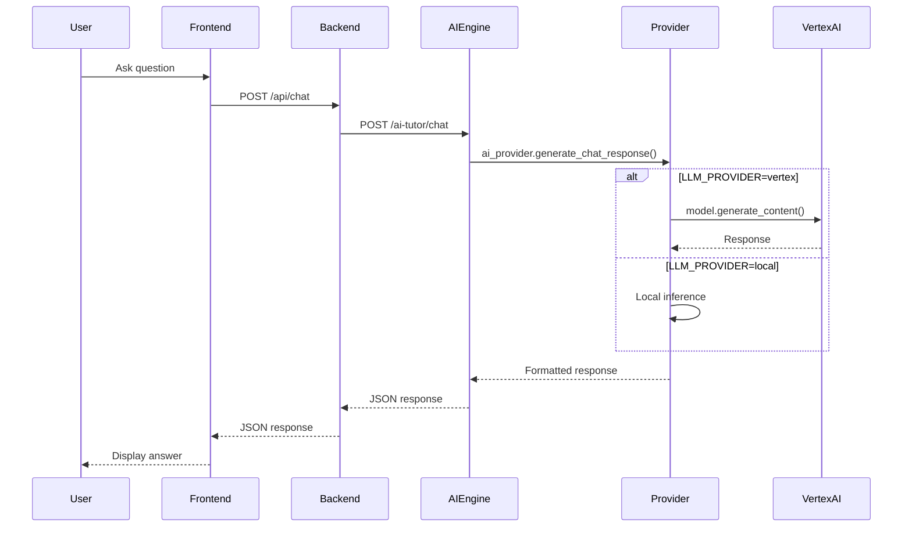

# ProMentor AI - Architecture Overview

## Executive Summary

**ProMentor AI** is an AI-powered educational platform for learning programming. The system consists of a Next.js frontend, FastAPI backend, and a Flask-based AI engine that provides personalized tutoring, code analysis, and adaptive challenge generation.

**Recent Changes**: The AI engine has been refactored from a monolithic architecture to a **Strategy Pattern** implementation, enabling dynamic selection between multiple LLM providers (Local ML models, Google Vertex AI, OpenRouter).

---

## Project Structure

```
promentor-ai/
├── src/                          # Next.js Frontend (React/TypeScript)
├── backend/                      # FastAPI Backend (Python)
├── ai-engine/                    # Flask AI Service (Python)
│   ├── main.py                   # Flask application & API routes
│   ├── models.py                 # Local ML models (TinyLlama, CodeT5)
│   ├── providers/                # NEW: Strategy Pattern providers
│   │   ├── __init__.py
│   │   ├── base.py              # AIProvider interface
│   │   ├── factory.py           # Provider factory
│   │   ├── local.py             # Local models adapter
│   │   ├── vertex.py            # Google Vertex AI provider
│   │   └── openrouter.py        # OpenRouter API provider
│   ├── requirements.txt
│   └── test_integration.py
├── docker-compose.yml
└── .env.example
```

---

## System Architecture

### High-Level Component Diagram



---

## AI Engine Architecture (Detail)

### Strategy Pattern Implementation

The AI engine now uses the **Strategy Pattern** to support multiple LLM providers interchangeably.



### Provider Selection Flow

1. **Environment Configuration**: `LLM_PROVIDER` environment variable determines the provider
2. **Factory Initialization**: `get_ai_provider()` creates the appropriate provider instance
3. **Dependency Injection**: Main application uses the provider interface
4. **Runtime Behavior**: All AI operations delegate to the selected provider

---

## API Endpoints

### AI Engine Endpoints (Flask Service)

| Endpoint | Method | Purpose | Provider Method |
|----------|--------|---------|-----------------|
| `/health` | GET | Health check | N/A |
| `/ai-tutor/chat` | POST | AI tutor conversation | `generate_chat_response()` |
| `/challenges/generate` | POST | Generate coding challenges | N/A (internal logic) |
| `/code/analyze` | POST | Analyze submitted code | `analyze_code()` |
| `/learning-path/recommend` | POST | Recommend learning path | N/A (internal logic) |

### Request/Response Examples

#### AI Tutor Chat

**Request:**
```json
{
  "message": "How do I iterate through a Python list?",
  "context": {
    "current_topic": "Python loops",
    "user_level": "beginner"
  },
  "personality": "encouraging"
}
```

**Response:**
```json
{
  "success": true,
  "response": {
    "message": "Great question! In Python, you can use a for loop...",
    "suggestions": [
      "Consider using enumerate() for index tracking",
      "Practice with different data structures"
    ],
    "resources": [
      {
        "title": "Mastering Loops in Programming",
        "url": "/learn/concepts/loops",
        "type": "tutorial"
      }
    ],
    "model_used": "gemini-1.5-pro"
  }
}
```

#### Code Analysis

**Request:**
```json
{
  "code": "def sum_array(arr):\n    total = 0\n    for i in range(len(arr)):\n        total += arr[i]\n    return total",
  "language": "python"
}
```

**Response:**
```json
{
  "success": true,
  "analysis": {
    "syntax_errors": [],
    "code_quality": {
      "readability_score": 85,
      "complexity_score": 2,
      "maintainability_score": 90
    },
    "performance": {
      "time_complexity": "O(n)",
      "space_complexity": "O(1)"
    },
    "best_practices": [],
    "suggestions": [
      "Consider using enumerate() instead of range(len())"
    ],
    "ai_insights": {
      "ai_analysis": "This is a correct implementation but can be simplified using Python's built-in sum() or list comprehension...",
      "confidence": 0.95,
      "model_used": "gemini-1.5-pro"
    }
  }
}
```

---

## Provider Implementations

### 1. Local Models Provider (`providers/local.py`)

- **Technology**: Hugging Face Transformers
- **Models**: 
  - Chat: TinyLlama-1.1B-Chat-v1.0
  - Code: Salesforce/codet5-small
- **Authentication**: None required
- **Use Case**: Development, offline operation, cost-free inference
- **Trade-offs**: Lower quality responses, slower on CPU

### 2. Vertex AI Provider (`providers/vertex.py`)

- **Technology**: Google Cloud Vertex AI SDK
- **Model**: Gemini 1.5 Pro (configurable via `VERTEX_MODEL_NAME`)
- **Authentication**: Application Default Credentials (ADC)
- **Configuration**:
  - `GOOGLE_CLOUD_PROJECT`: GCP project ID
  - `VERTEX_MODEL_NAME`: Model name (default: "gemini-1.5-pro")
- **Use Case**: Production, high-quality responses, enterprise deployment
- **Trade-offs**: Requires GCP account, costs per API call

### 3. OpenRouter Provider (`providers/openrouter.py`)

- **Technology**: REST API (requests library)
- **Model**: Configurable via `OPENROUTER_MODEL_NAME`
- **Authentication**: API key via `OPENROUTER_API_KEY`
- **Configuration**:
  - `OPENROUTER_API_KEY`: API key
  - `OPENROUTER_MODEL_NAME`: Model identifier
- **Use Case**: Access to multiple external LLMs without direct provider accounts
- **Trade-offs**: Third-party dependency, potential rate limits

---

## Configuration

### Environment Variables

| Variable | Required | Default | Description |
|----------|----------|---------|-------------|
| `LLM_PROVIDER` | No | `local` | Provider selection: `local`, `vertex`, `openrouter` |
| `GOOGLE_CLOUD_PROJECT` | For Vertex | - | GCP project ID |
| `VERTEX_MODEL_NAME` | No | `gemini-1.5-pro` | Vertex AI model name |
| `OPENROUTER_API_KEY` | For OpenRouter | - | OpenRouter API key |
| `OPENROUTER_MODEL_NAME` | No | `google/gemini-pro-1.5` | OpenRouter model identifier |
| `REDIS_URL` | No | `redis://localhost:6379` | Redis connection string |
| `MODEL_CACHE_DIR` | No | `/tmp/model_cache` | Local models cache directory |

### Example Configuration Files

#### Local Development (`.env`)
```bash
LLM_PROVIDER=local
REDIS_URL=redis://localhost:6379
MODEL_CACHE_DIR=./model_cache
```

#### Production with Vertex AI (`.env`)
```bash
LLM_PROVIDER=vertex
GOOGLE_CLOUD_PROJECT=my-gcp-project
VERTEX_MODEL_NAME=gemini-1.5-pro
REDIS_URL=redis://production-redis:6379
```

#### Production with OpenRouter (`.env`)
```bash
LLM_PROVIDER=openrouter
OPENROUTER_API_KEY=sk-or-v1-xxxxxxxxxxxxx
OPENROUTER_MODEL_NAME=google/gemini-pro-1.5
REDIS_URL=redis://production-redis:6379
```

---

## Design Patterns

### 1. Strategy Pattern
- **Location**: `ai-engine/providers/`
- **Purpose**: Encapsulate LLM provider logic, allow runtime provider selection
- **Benefits**: Easy to add new providers, testable, follows Open/Closed Principle

### 2. Factory Pattern
- **Location**: `providers/factory.py`
- **Purpose**: Centralize provider instantiation logic
- **Benefits**: Single responsibility, simplified configuration

### 3. Adapter Pattern
- **Location**: `providers/local.py`
- **Purpose**: Wrap existing `models.py` logic into new interface
- **Benefits**: Backward compatibility, code reuse

### 4. Singleton Pattern
- **Location**: `models.py` (ModelLoader)
- **Purpose**: Ensure only one instance of heavy ML models
- **Benefits**: Memory efficiency, shared model loading

---

## Data Flow Example

### AI Tutor Chat Request Flow



---

## Deployment Considerations

### Docker Deployment

The system uses Docker Compose with the following services:
- **frontend**: Next.js application
- **backend**: FastAPI service
- **ai-engine**: Flask AI service
- **redis**: Caching layer
- **mongodb**: Database

### Scaling Recommendations

1. **Local Provider**: 
   - Requires GPU for acceptable performance
   - Consider horizontal scaling with model caching
   
2. **Vertex AI Provider**:
   - Stateless, easily horizontally scalable
   - Consider request batching for cost optimization
   
3. **OpenRouter Provider**:
   - Stateless, horizontally scalable
   - Monitor rate limits

### Security

- API keys stored in environment variables
- Vertex AI uses ADC (no hardcoded credentials)
- Input validation on all endpoints
- CORS configured via Flask-CORS

---

## Testing

### Integration Tests

Location: `ai-engine/test_integration.py`

Tests verify:
- ✓ Provider factory properly initializes
- ✓ All provider classes exist
- ✓ Main.py uses provider interface
- ✓ API endpoints structure
- ✓ Response format compliance

Run tests:
```bash
cd ai-engine
python test_integration.py
```

---

## Dependencies

### Core Dependencies (ai-engine)

```
flask==3.0.0
flask-cors==4.0.0
redis==5.0.1
scikit-learn==1.3.2
requests==2.31.0
gunicorn==21.2.0

# Local ML Models
torch==2.1.2
transformers==4.36.2
accelerate==0.25.0

# Vertex AI
google-cloud-aiplatform>=1.38.0
```

---

## Migration Path

### From Previous Architecture

**Before**: Direct calls to `get_custom_tutor()` and `get_custom_analyzer()`

```python
custom_tutor = get_custom_tutor()
response = custom_tutor.generate_response(message, context, personality)
```

**After**: Unified provider interface

```python
ai_provider = get_ai_provider()
response = ai_provider.generate_chat_response(message, context, personality)
```

### Backward Compatibility

- ✓ API endpoints unchanged
- ✓ Response format identical
- ✓ `models.py` still exists and functional
- ✓ Default behavior (`LLM_PROVIDER=local`) maintains original functionality

---

## Next Steps & Roadmap

### Immediate Tasks
1. Production deployment with Vertex AI
2. Performance monitoring and logging
3. Cost tracking for cloud providers
4. A/B testing different providers

### Future Enhancements
1. Add Azure OpenAI provider
2. Add Claude (Anthropic) provider
3. Implement provider failover/fallback
4. Add response streaming support
5. Implement provider-level caching strategies

---

## Contacts & Resources

- **Repository**: NAScherba71/promentor-ai
- **Documentation**: `/docs` directory
- **Migration Guide**: `ai-engine/MIGRATION.md`
- **Summary**: `ai-engine/SUMMARY.md`
